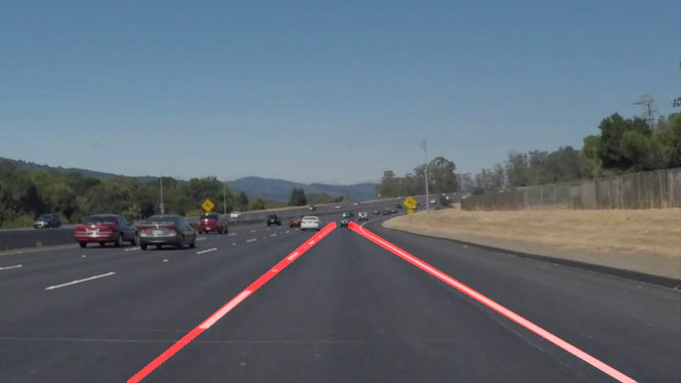
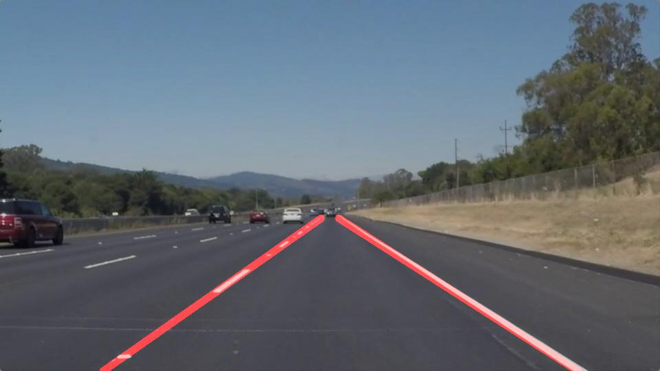
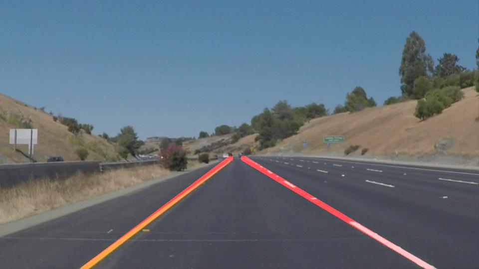
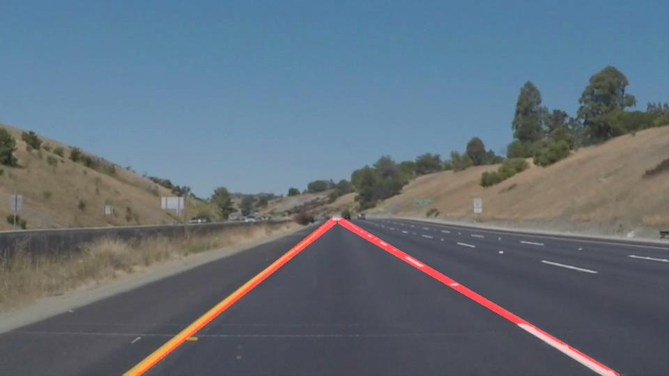

# **Finding Lane Lines on the Road** 
---

**Finding Lane Lines on the Road**

This project was developed in python using openCV libraries in jupyter notebook. The code uses predefined functions to achieve the project goals.


---

### 1. Lane Finding : Pipeline

* **Read image and convert to grayscale**

The original image was read and converted to graycale

```
image = mpimg.imread('test_images/whiteCarLaneSwitch.jpg')
gray=grayscale(image)
```

* **Apply Gaussian smoothing and Canny edges**

Experiments were done and kernel value "5" was chosen to apply gaussian smoothing

```
kernel_size= 5
img_blur=gaussian_blur(gray,kernel_size)
```

The thresholds were canny edges were arrived at by experiments and min_val=90 and max_val=190 worked well for the given set of examples

`canny_edges=canny(img_blur, 90,190)`

* **Finding region of interest**
The region of interest was identified to ensure that the lane lines shown in the images/videos are being encapsulated in the polygon.

```
vertices = np.array([[(50,imshape[0]),(imshape[1]/2.05,imshape[0]/1.7), (imshape[1]/1.95,imshape[0]/1.7), (imshape[1],imshape[0])]], dtype=np.int32)
mask_edges = region_of_interest(canny_edges, vertices)
```

* **Apply houghlines algorthm to find lanes in image**

Tuning the various parameters (rho,theta,min_length,line_gap) and applying houghlines algorithm to extract lines from the above processed image

```
rho = 2 
theta = np.pi/180 
threshold = 20    
min_line_len = 20 
max_line_gap = 5   
lines = hough_lines(mask_edges, rho, theta, threshold, min_line_len, max_line_gap)
```

* **Filtering,averaging and drawing lines**

Lane Lines were filtered based on the slope for left and right lines. The line equation _(y = mx+c)_ was used to calculate slope and constants. The slope and constant value was averaged for every frame and corresponding X values were computed based on fixed y values.

```
def drawLaneLines(img,lines):

  '''This functions draws lane lines by using slope and constants --> 
  y= mx + c. '''
    
  # Iterate over the output "lines" and draw lines on a blank image
  ##Parameter Initializations
  p_left_counter =0
  m_left =0
  c_left =0
  line_image = np.copy(img)*0 # creating a blank to draw lines on
  p_right_counter =0
  m_right =0
  c_right =0
  m_left_avg =0
  m_right_avg =0


  for line in lines:
      for x1,y1,x2,y2 in line:
          ## Find slope and calculate new X & Y coordinates for plotting

          ## Line Equation -->  y =mx+c ; where m is slope and c is constant

          ##Slope of line
          m = float((y2-y1)/(x2-x1))
          ##Constant of line
          c = (y1-m*x1)
          ##Length of line
          length = math.sqrt(pow(y2-y1,2)+ pow(x2-x1,2))

          ## Checking for slope of lines
          if not np.isnan(m) or np.isinf(m) or (m == 0):
            ## Left Lane lines  
            if (m > -1.5) and (m < -0.5) :
                p_left_counter +=1  
                m_left +=m
                c_left +=c
            
            ## Right Lane lines  
            if (m > 0.5) and (m < 1.5) :
              p_right_counter +=1
              m_right +=m
              c_right +=c

  ## Calculating left averages
  if(p_left_counter!=0):
    m_left_avg = m_left/p_left_counter
    c_left_avg = c_left/p_left_counter

  ## Calculating right averages
  if(p_right_counter):
    m_right_avg = m_right/p_right_counter
    c_right_avg = c_right/p_right_counter

  y_max = imshape[0]
  y_min = int(imshape[0]/1.7)

  ## Calculating left coordinates
  if(m_left_avg!=0):
    x_max= int((y_max - c_left_avg)/m_left_avg)
    x_min= int((y_min - c_left_avg)/m_left_avg)
    cv2.line(line_image,(x_min,y_min),(x_max,y_max),(255,0,0),10)

  ## Calculating right coordinates
  if(m_right_avg!=0):
    #y = mx+c
    #x = y-c/m
    x_max= int((y_max - c_right_avg)/m_right_avg)
    x_min= int((y_min - c_right_avg)/m_right_avg)
    cv2.line(line_image,(x_min,y_min),(x_max,y_max),(255,0,0),10)

  return line_image
```

* **Drawling lane lines on the original image**
Finally, lane llines were drawn on the orginal image (video frames) to annotate the lanes in the video frames

```
result = weighted_img(line_image,image)
```

* **Annotated outputs**










### 2. Identify potential shortcomings with your current pipeline

Potential shortcomings in the pipeline are as follows :
* Noisy data (rainy/dusty/dark/shahow) may lead to missing lane lines
* Steep curves or steep ascent/descent would require further tests and tuning parameters
* In case of no lane markings (missing lane lines in roads for a patch), lanes lines may not be drawn

### 3. Suggest possible improvements to your pipeline
Possible inprovements can be to store historical data for tracking of lane lines in case of missing lane line patches.Annotations transition be made more smooth.Lanes are currently drawn as lines but in real scenario they are curvy and therefore polynomial function can be used to consider all scenarios.